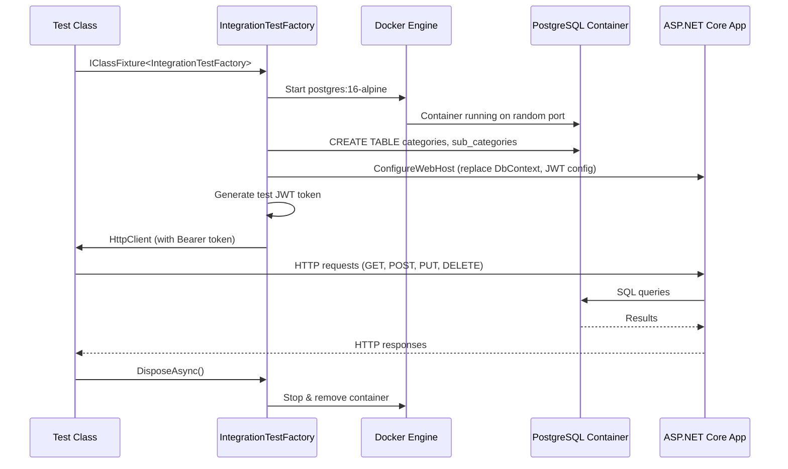

# Unit & Integration Testing

Comprehensive test suite for the **Catalog Service** REST API using **xUnit**, **Moq**, **EF Core InMemory**, **Testcontainers**, and **Coverlet** for code coverage.

---

## Table of Contents

- [Prerequisites](#prerequisites)
- [Test Project Structure](#test-project-structure)
- [Technology Stack](#technology-stack)
- [Project Setup](#project-setup)
  - [Create the Test Project](#create-the-test-project)
  - [Install Dependencies](#install-dependencies)
  - [Project Configuration](#project-configuration)
- [Test Categories](#test-categories)
  - [Unit Tests](#unit-tests)
  - [Integration Tests](#integration-tests)
- [Test Inventory](#test-inventory)
- [Run Tests](#run-tests)
  - [Run All Tests](#run-all-tests)
  - [Run Unit Tests Only](#run-unit-tests-only)
  - [Run Integration Tests Only](#run-integration-tests-only)
  - [Run a Specific Test Class](#run-a-specific-test-class)
  - [Run a Specific Test Method](#run-a-specific-test-method)
  - [Verbose Output](#verbose-output)
- [Code Coverage Report](#code-coverage-report)
  - [Generate Cobertura XML Report](#generate-cobertura-xml-report)
  - [Generate HTML Report](#generate-html-report)
  - [Coverage Exclusions](#coverage-exclusions)
- [Integration Test Architecture](#integration-test-architecture)
  - [IntegrationTestFactory](#integrationtestfactory)
  - [How It Works](#how-it-works)
  - [Docker Requirement](#docker-requirement)
- [Writing New Tests](#writing-new-tests)
  - [Unit Test Template](#unit-test-template)
  - [Integration Test Template](#integration-test-template)
- [Troubleshooting](#troubleshooting)
- [Tips](#tips)

---

## Prerequisites

- [.NET 10 SDK](https://dotnet.microsoft.com/download/dotnet/10.0)
- [Docker Desktop](https://www.docker.com/products/docker-desktop/) — **required for integration tests** (Testcontainers spins up a real PostgreSQL container)
- [ReportGenerator](https://github.com/danielpalme/ReportGenerator) — optional, for HTML coverage reports

---

## Test Project Structure

```
Tests/
├── catalog-service.Tests.csproj           # Test project file with dependencies & coverage config
│
├── IntegrationTestFactory.cs              # WebApplicationFactory + Testcontainers setup
│
├── ── Unit Tests ──────────────────────
├── BaseApiControllerTests.cs              # Base controller response helpers (6 tests)
├── CategoriesControllerTests.cs           # Categories controller actions (10 tests)
├── SubCategoriesControllerTests.cs        # SubCategories controller actions (10 tests)
├── CategoryServiceTests.cs                # Category business logic & caching (13 tests)
├── SubCategoryServiceTests.cs             # SubCategory business logic & caching (15 tests)
├── CategoryRepositoryTests.cs             # Category EF Core queries (33 tests)
├── SubCategoryRepositoryTests.cs          # SubCategory EF Core queries (16 tests)
├── UnitOfWorkTests.cs                     # Transaction management (9 tests)
├── DataTests.cs                           # DbContext configuration (3 tests)
├── MiddlewareTests.cs                     # Request pipeline middleware (6 tests)
├── DtoTests.cs                            # DTO record validation (12 tests)
├── QueryParametersTests.cs                # Pagination & filter models (21 tests)
├── SortHelperTests.cs                     # Dynamic sort expressions (12 tests)
├── CursorHelperTests.cs                   # Base64 cursor encoding/decoding (9 tests)
├── ErrorTypesTests.cs                     # Error type URI constants (4 tests)
├── UpstashDistributedCacheTests.cs        # Redis cache implementation (13 tests)
│
├── ── Integration Tests ───────────────
├── CategoriesIntegrationTests.cs          # Full HTTP pipeline — Categories (11 tests)
├── SubCategoriesIntegrationTests.cs       # Full HTTP pipeline — SubCategories (13 tests)
│
├── coverage/                              # Generated coverage reports (git-ignored)
├── bin/                                   # Build output
└── obj/                                   # Build intermediates
```

---

## Technology Stack

| Package | Version | Purpose |
|---------|---------|---------|
| **xUnit** | 2.9.3 | Test framework |
| **xunit.runner.visualstudio** | 2.8.2 | Visual Studio / `dotnet test` runner |
| **Microsoft.NET.Test.Sdk** | 17.14.1 | Test host and execution engine |
| **Moq** | 4.20.72 | Mocking framework for unit tests |
| **Microsoft.EntityFrameworkCore.InMemory** | 10.0.5 | In-memory database for repository tests |
| **Microsoft.AspNetCore.Mvc.Testing** | 10.0.5 | `WebApplicationFactory` for integration tests |
| **Testcontainers.PostgreSql** | 4.11.0 | Docker-based PostgreSQL for integration tests |
| **System.IdentityModel.Tokens.Jwt** | 8.17.0 | JWT token generation for auth testing |
| **Coverlet.MSBuild** | 8.0.1 | Code coverage instrumentation (MSBuild) |
| **Coverlet.Collector** | 6.0.4 | Code coverage data collector |

---

## Project Setup

### Create the Test Project

```powershell
# Create xUnit test project
dotnet new xunit -n catalog-service.Tests -o Tests

# Add a reference to the main project
dotnet add Tests/catalog-service.Tests.csproj reference catalog-service.csproj
```

### Install Dependencies

```powershell
cd Tests

# Mocking framework
dotnet add package Moq

# EF Core In-Memory provider (unit tests)
dotnet add package Microsoft.EntityFrameworkCore.InMemory

# Integration testing with WebApplicationFactory
dotnet add package Microsoft.AspNetCore.Mvc.Testing

# Testcontainers — real PostgreSQL for integration tests
dotnet add package Testcontainers.PostgreSql

# JWT generation for authenticated endpoint tests
dotnet add package System.IdentityModel.Tokens.Jwt

# Code coverage (MSBuild integration)
dotnet add package coverlet.msbuild

# Code coverage (data collector)
dotnet add package coverlet.collector

cd ..
```

### Project Configuration

Key settings in `catalog-service.Tests.csproj`:

```xml
<PropertyGroup>
    <RootNamespace>catalog_service.Tests</RootNamespace>
    <IsPackable>false</IsPackable>

    <!-- Coverlet: exclude auto-generated code from coverage -->
    <ExcludeByAttribute>GeneratedCodeAttribute,CompilerGeneratedAttribute</ExcludeByAttribute>
    <Exclude>
        [catalog-service]Microsoft.AspNetCore.OpenApi.Generated*,
        [catalog-service]System.Runtime.CompilerServices*
    </Exclude>
    <ExcludeByFile>**/Program.cs,**/SubCategoryRepository.cs</ExcludeByFile>
</PropertyGroup>
```

> **Why exclude `Program.cs`?** — It's the application bootstrap; testing it is the job of integration tests.
>
> **Why exclude `SubCategoryRepository.cs`?** — Contains raw SQL queries that cannot be tested with EF Core InMemory; covered by integration tests instead.

The main project also exposes internals to the test project:

```xml
<!-- In catalog-service.csproj -->
<ItemGroup>
    <InternalsVisibleTo Include="catalog-service.Tests" />
</ItemGroup>
```

---

## Test Categories

### Unit Tests

Unit tests run **in-process** without any external dependencies (no database, no Docker, no network). They use:

- **Moq** to mock interfaces (`ICategoryService`, `ICategoryRepository`, `IDistributedCache`, `ILogger<T>`)
- **EF Core InMemory** to test repository logic against a fast, in-memory database
- **DefaultHttpContext** to simulate HTTP contexts for middleware and controller tests

| Layer | Test Class | Tests | What It Verifies |
|-------|-----------|-------|-----------------|
| **Controllers** | `BaseApiControllerTests` | 6 | `ApiOk`, `ApiCreated`, `ApiNotFound`, `ApiValidationError` response envelopes |
| **Controllers** | `CategoriesControllerTests` | 10 | GetAll, GetById, Create, Update, Delete — status codes, response format, pagination meta |
| **Controllers** | `SubCategoriesControllerTests` | 10 | GetAll, GetByCategoryId, GetById, Create, Update, Delete — status codes, response format |
| **Services** | `CategoryServiceTests` | 13 | DTO mapping, cache hit/miss, CRUD delegation, partial updates |
| **Services** | `SubCategoryServiceTests` | 15 | DTO mapping, cache hit/miss, CRUD delegation, partial updates, category ID handling |
| **Repositories** | `CategoryRepositoryTests` | 33 | Pagination, filtering (name/code), sorting (asc/desc), cursor-based pagination, CRUD operations |
| **Repositories** | `SubCategoryRepositoryTests` | 16 | Pagination, filtering, sorting, cursor, CRUD, by-category queries |
| **Data** | `DataTests` | 3 | DbContext entity configuration, table mappings |
| **Data** | `UnitOfWorkTests` | 9 | Begin/commit/rollback transactions, SaveChanges, Dispose patterns |
| **Middleware** | `MiddlewareTests` | 6 | `RequestIdMiddleware` (X-Request-Id header), `RequestLoggingMiddleware` (log levels), `GlobalExceptionMiddleware` (RFC 7807 500 response) |
| **Helpers** | `SortHelperTests` | 12 | Sort expression parsing, multi-field sort, invalid input handling, default behaviour |
| **Helpers** | `CursorHelperTests` | 9 | Base64 cursor encode/decode, edge cases, invalid cursors |
| **Models** | `DtoTests` | 12 | DTO record construction, equality, default values |
| **Models** | `QueryParametersTests` | 21 | Default values, boundary validation (page/limit), sort parsing, filter combinations |
| **Constants** | `ErrorTypesTests` | 4 | Error type URI constants match expected RFC 7807 format |
| **Services** | `UpstashDistributedCacheTests` | 13 | Get/Set/Remove/Refresh cache operations, key prefixing, TTL handling, error resilience |

**Total Unit Tests: 192**

### Integration Tests

Integration tests exercise the **full HTTP pipeline** — from HTTP request through middleware, authentication, controllers, services, repositories, to a **real PostgreSQL database** running in Docker via Testcontainers.

| Test Class | Tests | What It Verifies |
|-----------|-------|-----------------|
| `CategoriesIntegrationTests` | 11 | GET (empty, with data), GetById (found, not found), POST, PUT (full, partial, not found), DELETE (found, not found), full CRUD lifecycle |
| `SubCategoriesIntegrationTests` | 13 | GET (empty, with data), GetByCategoryId (found, empty), GetById (found, not found), POST, PUT (full, partial, not found), DELETE (found, not found), full CRUD lifecycle |

**Total Integration Tests: 24**

### Total: 216 tests

---

## Test Inventory

| Test File | Layer | Tests | Mocking Strategy |
|-----------|-------|-------|-----------------|
| `BaseApiControllerTests.cs` | Controller | 6 | `DefaultHttpContext` |
| `CategoriesControllerTests.cs` | Controller | 10 | `Moq<ICategoryService>`, `Moq<ILogger>` |
| `SubCategoriesControllerTests.cs` | Controller | 10 | `Moq<ISubCategoryService>`, `Moq<ILogger>` |
| `CategoryServiceTests.cs` | Service | 13 | `Moq<ICategoryRepository>`, `Moq<IDistributedCache>` |
| `SubCategoryServiceTests.cs` | Service | 15 | `Moq<ISubCategoryRepository>`, `Moq<IDistributedCache>` |
| `CategoryRepositoryTests.cs` | Repository | 33 | EF Core InMemory |
| `SubCategoryRepositoryTests.cs` | Repository | 16 | EF Core InMemory |
| `DataTests.cs` | Data | 3 | EF Core InMemory |
| `UnitOfWorkTests.cs` | Data | 9 | EF Core InMemory |
| `MiddlewareTests.cs` | Middleware | 6 | `DefaultHttpContext`, `Moq<ILogger>` |
| `SortHelperTests.cs` | Helper | 12 | None (pure functions) |
| `CursorHelperTests.cs` | Helper | 9 | None (pure functions) |
| `DtoTests.cs` | Model | 12 | None (record types) |
| `QueryParametersTests.cs` | Model | 21 | None (POCOs) |
| `ErrorTypesTests.cs` | Constant | 4 | None (static strings) |
| `UpstashDistributedCacheTests.cs` | Service | 13 | `Moq<HttpMessageHandler>` |
| `CategoriesIntegrationTests.cs` | Integration | 11 | Testcontainers (PostgreSQL) |
| `SubCategoriesIntegrationTests.cs` | Integration | 13 | Testcontainers (PostgreSQL) |

---

## Run Tests

All commands are run from the **project root** directory.

### Run All Tests

```powershell
dotnet test Tests/catalog-service.Tests.csproj
```

### Run Unit Tests Only

Excludes integration tests (which require Docker):

```powershell
dotnet test Tests/catalog-service.Tests.csproj --filter "FullyQualifiedName!~IntegrationTests"
```

### Run Integration Tests Only

> ⚠️ **Docker Desktop must be running.** Testcontainers will automatically pull `postgres:16-alpine` and start a container.

```powershell
dotnet test Tests/catalog-service.Tests.csproj --filter "FullyQualifiedName~IntegrationTests"
```

### Run a Specific Test Class

```powershell
# Categories controller tests only
dotnet test Tests/catalog-service.Tests.csproj --filter "FullyQualifiedName~CategoriesControllerTests"

# Category service tests only
dotnet test Tests/catalog-service.Tests.csproj --filter "FullyQualifiedName~CategoryServiceTests"

# Middleware tests only
dotnet test Tests/catalog-service.Tests.csproj --filter "FullyQualifiedName~MiddlewareTests"

# Category repository tests only
dotnet test Tests/catalog-service.Tests.csproj --filter "FullyQualifiedName~CategoryRepositoryTests"
```

### Run a Specific Test Method

```powershell
dotnet test Tests/catalog-service.Tests.csproj --filter "FullyQualifiedName~CategoryServiceTests.GetAllAsync_CacheHit_ReturnsFromCache"
```

### Verbose Output

```powershell
# Detailed console output
dotnet test Tests/catalog-service.Tests.csproj --logger "console;verbosity=detailed"

# Diagnostics output (trx format for CI/CD)
dotnet test Tests/catalog-service.Tests.csproj --logger "trx;LogFileName=test-results.trx" --results-directory Tests/TestResults
```

---

## Code Coverage Report

### Generate Cobertura XML Report

Uses **Coverlet MSBuild** to collect coverage data during test execution:

```powershell
dotnet test Tests/catalog-service.Tests.csproj `
  /p:CollectCoverage=true `
  /p:CoverletOutputFormat=cobertura `
  /p:CoverletOutput=./coverage/
```

This generates `Tests/coverage/coverage.cobertura.xml`.

### Generate HTML Report

Install the **ReportGenerator** global tool (one-time setup):

```powershell
dotnet tool install -g dotnet-reportgenerator-globaltool
```

Generate the interactive HTML report:

```powershell
reportgenerator `
  -reports:Tests/coverage/coverage.cobertura.xml `
  -targetdir:Tests/coverage/report `
  -reporttypes:Html
```

Open the report in your browser:

```powershell
start Tests/coverage/report/index.html
```

### Combined Command (Generate + Open)

Run everything in one go:

```powershell
dotnet test Tests/catalog-service.Tests.csproj `
  /p:CollectCoverage=true `
  /p:CoverletOutputFormat=cobertura `
  /p:CoverletOutput=./coverage/ && `
reportgenerator `
  -reports:Tests/coverage/coverage.cobertura.xml `
  -targetdir:Tests/coverage/report `
  -reporttypes:Html && `
start Tests/coverage/report/index.html
```

### Other Report Formats

```powershell
# JSON + Cobertura + OpenCover (multi-format)
dotnet test Tests/catalog-service.Tests.csproj `
  /p:CollectCoverage=true `
  /p:CoverletOutputFormat=\"json,cobertura,opencover\" `
  /p:CoverletOutput=./coverage/

# Coveralls / SonarQube format
reportgenerator `
  -reports:Tests/coverage/coverage.cobertura.xml `
  -targetdir:Tests/coverage/report `
  -reporttypes:"Html;Badges;SonarQube"
```

### Coverage Exclusions

The following are excluded from coverage metrics (configured in `catalog-service.Tests.csproj`):

| Exclusion | Reason |
|-----------|--------|
| `GeneratedCodeAttribute` | Auto-generated code (OpenAPI, EF scaffolding) |
| `CompilerGeneratedAttribute` | Compiler-generated code (async state machines, records) |
| `Microsoft.AspNetCore.OpenApi.Generated*` | OpenAPI auto-generated client classes |
| `System.Runtime.CompilerServices*` | Runtime compiler services |
| `**/Program.cs` | Application bootstrap — tested via integration tests |
| `**/SubCategoryRepository.cs` | Raw SQL queries — tested via integration tests |

---

## Integration Test Architecture

### IntegrationTestFactory

The `IntegrationTestFactory` class is the heart of integration testing. It extends `WebApplicationFactory<Program>` and implements `IAsyncLifetime`.

```
IntegrationTestFactory
├── Starts a PostgreSQL 16 container (Testcontainers)
├── Creates tables (categories, sub_categories) via raw SQL
├── Replaces the app's DbContext with one targeting the container
├── Overrides JWT config for test token generation
├── Provides an HttpClient with a valid JWT Bearer token attached
└── Tears down the container on DisposeAsync()
```

### How It Works



### Docker Requirement

Integration tests **require Docker Desktop** to be running. Testcontainers will:

1. Pull `postgres:16-alpine` image (first run only)
2. Start a fresh container with a random port
3. Apply schema migrations
4. Run tests against the real database
5. Stop and remove the container when done

If Docker is not available, integration tests will **fail with a connection error**. Unit tests will still pass normally.

---

## Writing New Tests

### Unit Test Template

```csharp
using catalog_service.Services;
using Moq;

namespace catalog_service.Tests;

public class MyNewServiceTests
{
    private readonly Mock<IMyDependency> _dependencyMock = new();
    private readonly MyService _service;

    public MyNewServiceTests()
    {
        _service = new MyService(_dependencyMock.Object);
    }

    [Fact]
    public async Task MyMethod_Scenario_ExpectedBehavior()
    {
        // Arrange
        _dependencyMock.Setup(d => d.GetDataAsync(It.IsAny<int>(), It.IsAny<CancellationToken>()))
            .ReturnsAsync(new MyData { Id = 1, Name = "Test" });

        // Act
        var result = await _service.MyMethodAsync(1, CancellationToken.None);

        // Assert
        Assert.NotNull(result);
        Assert.Equal("Test", result.Name);
        _dependencyMock.Verify(d => d.GetDataAsync(1, It.IsAny<CancellationToken>()), Times.Once);
    }
}
```

### Integration Test Template

```csharp
using System.Net;
using System.Net.Http.Json;
using catalog_service.Dtos;

namespace catalog_service.Tests;

public class MyIntegrationTests : IClassFixture<IntegrationTestFactory>, IAsyncLifetime
{
    private readonly HttpClient _client;
    private const string BaseUrl = "/api/v1/my-resource";

    public MyIntegrationTests(IntegrationTestFactory factory)
    {
        _client = factory.HttpClient;
    }

    public Task InitializeAsync() => Task.CompletedTask;  // Clean up before each test
    public Task DisposeAsync() => Task.CompletedTask;

    [Fact]
    public async Task GetAll_ReturnsOk()
    {
        var response = await _client.GetAsync(BaseUrl);

        Assert.Equal(HttpStatusCode.OK, response.StatusCode);
    }

    [Fact]
    public async Task Create_ValidRequest_ReturnsCreated()
    {
        var request = new { Code = "TEST", Name = "Test Item" };

        var response = await _client.PostAsJsonAsync(BaseUrl, request);

        Assert.Equal(HttpStatusCode.Created, response.StatusCode);
        Assert.NotNull(response.Headers.Location);
    }
}
```

---

## Troubleshooting

| Problem | Cause | Solution |
|---------|-------|----------|
| Integration tests fail with `Docker is not running` | Docker Desktop is not started | Start Docker Desktop and wait for it to be ready |
| `Cannot connect to the Docker daemon` | Docker not installed or not on PATH | Install Docker Desktop and restart terminal |
| `Testcontainers: Could not find image` | First-time run, image not cached | Wait for `postgres:16-alpine` to download (~80 MB) |
| `Port already in use` | N/A — Testcontainers uses random ports | Should not happen; restart Docker if it does |
| Tests pass locally but fail in CI | Docker not available in CI pipeline | Add Docker service to your CI config (e.g., GitHub Actions `services: postgres`) |
| Coverage report shows 0% | Missing Coverlet package | Ensure `coverlet.msbuild` is installed |
| `ReportGenerator` not found | Tool not installed | Run `dotnet tool install -g dotnet-reportgenerator-globaltool` |

---

## Tips

1. **Run unit tests first** — They're fast (< 5s) and don't need Docker. Use them for quick feedback during development.
2. **Run integration tests before pushing** — Verify the full pipeline works with a real database.
3. **Use `--filter` for speed** — Focus on the test class you're actively working on instead of running the full suite.
4. **Naming convention** — Follow `MethodName_Scenario_ExpectedBehavior` for test method names (e.g., `GetById_NonExistingId_ReturnsNotFound`).
5. **Each integration test cleans up** — Tests implement `IAsyncLifetime` and clear data in `InitializeAsync()` for isolation.
6. **Check coverage trends** — Generate coverage reports regularly and aim for ≥ 80% line coverage on business logic.
7. **CI/CD integration** — Use the TRX logger (`--logger trx`) for test result publishing in Azure DevOps, GitHub Actions, etc.
